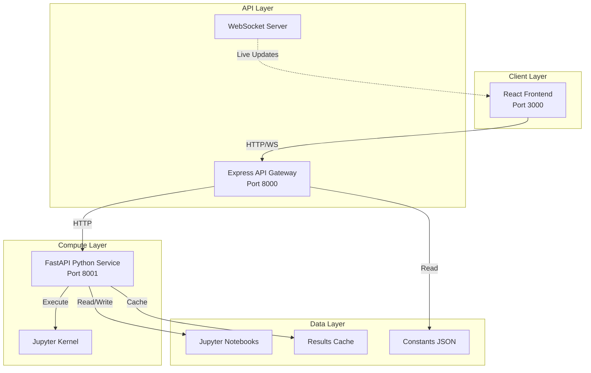
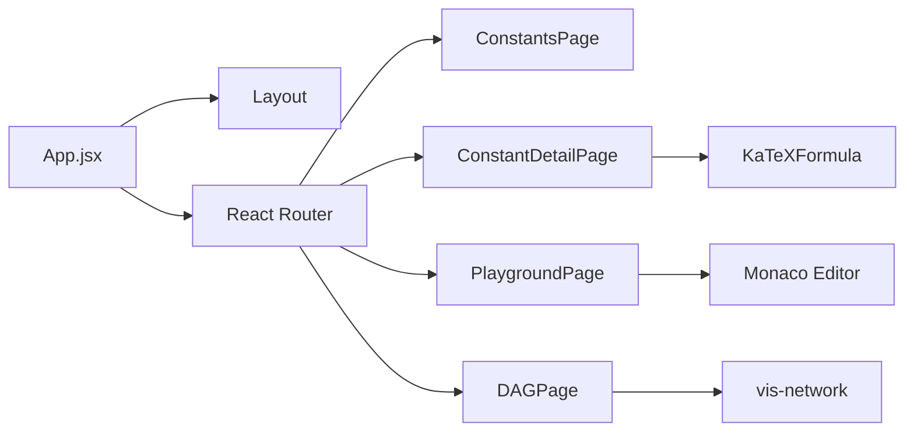
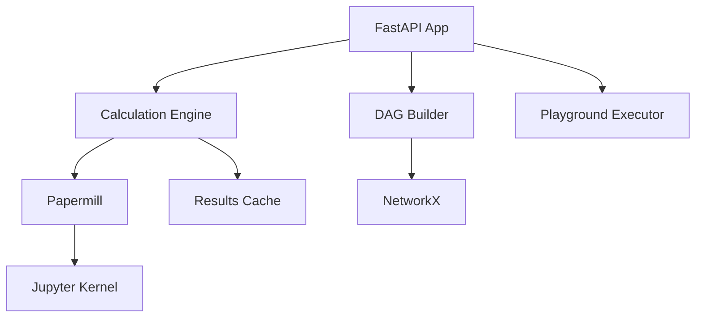
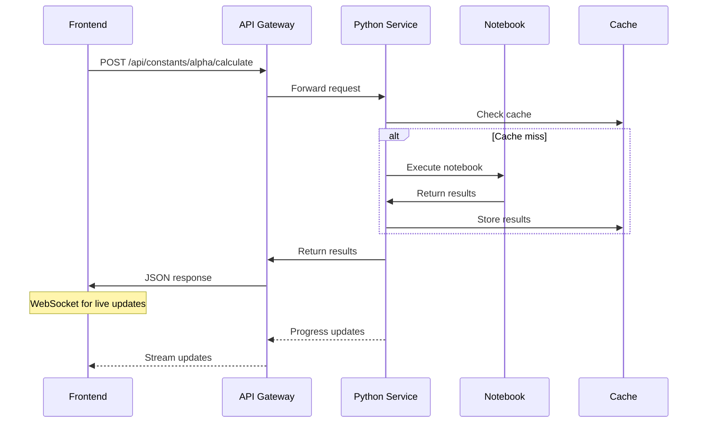
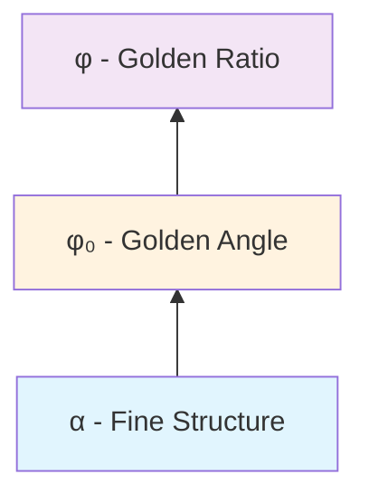
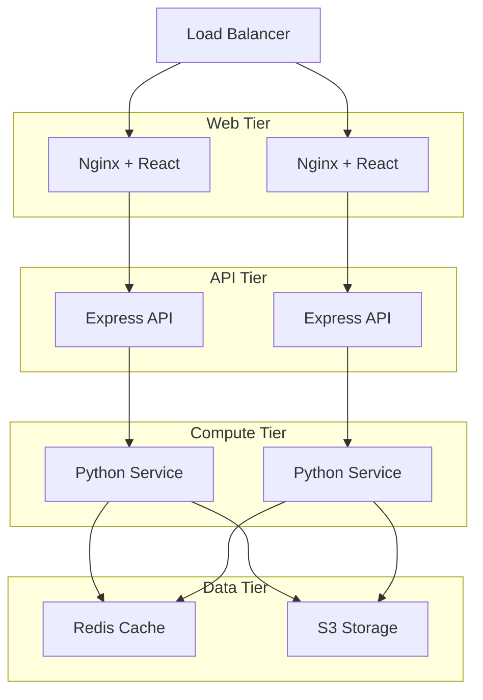
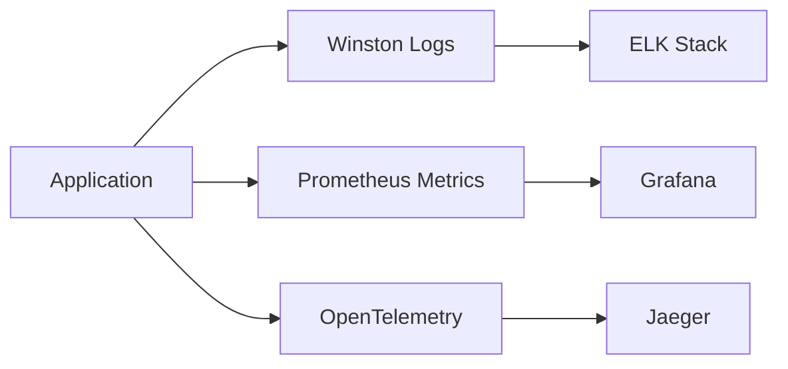
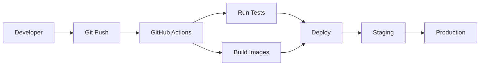

# Architecture Documentation

## System Overview

The Topological Constants Calculator is a three-tier application designed for calculating and exploring physics constants based on the Topological Fixed Point Framework.

## High-Level Architecture



## Component Details

### Frontend (React + Vite)

**Purpose**: Provides the user interface for exploring constants, running calculations, and visualizing relationships.

**Key Technologies**:
- React 18 with hooks
- Vite for fast development
- TailwindCSS for styling
- KaTeX for math rendering
- Monaco Editor for code editing
- vis-network for graph visualization

**Main Components**:


### Backend (Node.js + Express)

**Purpose**: Acts as an API gateway, handling authentication, rate limiting, and routing requests to appropriate services.

**Key Features**:
- RESTful API endpoints
- WebSocket support for live updates
- Swagger/OpenAPI documentation
- Request validation and error handling
- CORS configuration

**API Routes**:
```
GET    /api/constants              # List all constants
GET    /api/constants/:id          # Get constant details
POST   /api/constants/:id/calculate # Calculate constant
POST   /api/playground/run         # Run custom formula
GET    /api/dag                    # Get dependency graph
WS     /ws                         # WebSocket connection
```

### Compute Service (Python + FastAPI)

**Purpose**: Handles all mathematical computations, notebook execution, and caching.

**Key Components**:


**Execution Flow**:
1. Receives calculation request
2. Checks cache for existing results
3. Loads constant definition and dependencies
4. Executes Jupyter notebook with Papermill
5. Extracts results and stores in cache
6. Returns results via API

### Data Layer

**Constants Catalog Structure**:
```
constants/
├── data/                 # JSON definitions
│   ├── alpha.json       # Fine structure constant
│   ├── phi.json         # Golden ratio
│   └── phi_0.json       # Golden angle
├── notebooks/           # Generated notebooks
│   ├── alpha.ipynb
│   ├── phi.ipynb
│   └── phi_0.ipynb
├── results/             # Calculation results
└── scripts/             # Generation scripts
```

**Constant Definition Schema**:
```json
{
  "id": "string",
  "symbol": "string",
  "name": "string",
  "description": "string",
  "unit": "string",
  "formula": "string",
  "dependencies": ["string"],
  "category": "fundamental|derived|composite",
  "sources": [{
    "name": "string",
    "year": "number",
    "value": "number",
    "uncertainty": "number",
    "url": "string"
  }],
  "accuracyTarget": "number"
}
```

## Data Flow

### Calculation Request Flow



### Dependency Resolution



## Deployment Architecture

### Docker Compose Setup

```yaml
services:
  python:    # Compute service
  api:       # API gateway
  web:       # Frontend
```

### Production Deployment



## Security Considerations

1. **Input Validation**: All formula inputs are parsed with SymPy, preventing code injection
2. **Rate Limiting**: Express rate limiter prevents API abuse
3. **CORS**: Configured for specific origins in production
4. **Notebook Isolation**: Papermill executes notebooks in isolated kernels
5. **No Eval**: Frontend never uses eval() for formula rendering

## Performance Optimizations

1. **Caching Strategy**:
   - In-memory cache for recent calculations
   - Redis for distributed caching in production
   - Cache invalidation on constant updates

2. **Lazy Loading**:
   - Notebooks generated on-demand
   - Frontend code splitting with React.lazy()

3. **Parallel Execution**:
   - Multiple notebook kernels for concurrent calculations
   - WebSocket connection pooling

## Monitoring and Observability



## Development Workflow



## Future Enhancements

1. **GraphQL API**: Alternative to REST for flexible queries
2. **Real-time Collaboration**: Multiple users editing formulas
3. **GPU Acceleration**: For complex calculations
4. **Mobile App**: React Native client
5. **AI Assistant**: Help with formula creation 